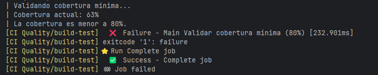
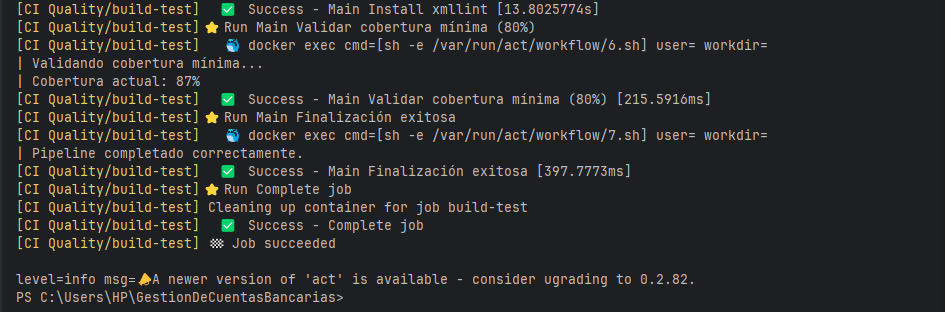

# RESPUESTAS – Parcial de Calidad de Software

## Parte 4 – Validación y logs

**1. Cómo identificar fallos en los logs**

- **Linter (Checkstyle):**
    - Se identifica porque aparecen mensajes de error `[ERROR]` durante la ejecución de `mvn checkstyle:check`.
    - Si hay errores de estilo, el job falla automáticamente.

- **Pruebas unitarias (JUnit):**
    - Se identifican fallos si algún test lanza excepción o falla un `assert`.
    - En los logs se verá `[FAILURE]` o resumen de tests fallidos (`Tests run: X, Failures: Y, Errors: Z`).

- **Cobertura (JaCoCo):**
    - La cobertura mínima se valida al final del pipeline.
    - Si el porcentaje de cobertura es menor al definido (80%), se muestra un mensaje como:
      ```
      Validando cobertura mínima...
      Cobertura actual: 63%
      La cobertura es menor a 80%.
      ```
    - Esto hace que el job falle (`exitcode 1`).

**2. Diferencia entre run fallido y exitoso**

- **Run fallido:**
    - Alguna de las etapas (linter, pruebas o cobertura) no cumple los requisitos.
    - Ejemplo de log fallido de cobertura:
       

- **Run exitoso:**
    - Todas las etapas se completan correctamente.
    - Ejemplo de log exitoso:
      
    

    - Resultado: **Job succeeded**.

---

## Parte 5 – IA y Ética

**1. Métodos para detectar código generado por IA**

- **Detección de patrones de IA:**  
  Herramientas como GPTZero analizan el código para detectar patrones típicos de generadores de IA.

- **Análisis de estilo y consistencia:**  
  Comparar el estilo de código con el historial de commits del estudiante o con estilos de código humano típicos.

**2. Limitaciones**

- No es posible asegurar al 100% la autoría del código porque:
    - Los detectores pueden dar **falsos positivos o negativos**.
    - La IA puede generar código que se parece mucho al humano.
    - Estilos de programación humanos también pueden ser similares entre distintas personas.

**3. Políticas razonables de uso de IA en educación y calidad**

- Permitir IA **solo como referencia o guía**, no para escribir el código final.
- Documentar siempre el uso de IA en proyectos académicos o profesionales.
- Los estudiantes deben **escribir manualmente el código principal**, asegurando aprendizaje y evaluación justa.
- Usar IA como **herramienta de apoyo**, no como reemplazo del proceso de desarrollo.

---
